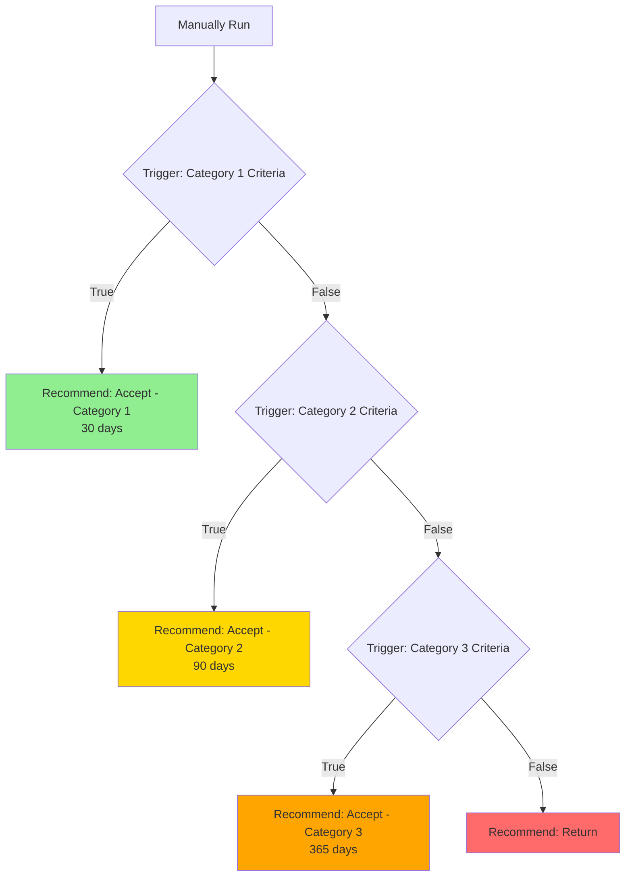

## Overview

**Pathways** are the module responsible for automating clinical workflows and processes. This workflow automation builder allows you to design and implement processes using rule-based decision trees.

Each pathway consists of **nodes** that you can drag and drop to create your workflow. Pathways help you automate clinical triage by defining a series of rules and recommendations based on referral information.

### Semi-Auto Mode

Pathways in this mode are triggered manually on demand by the user. This mode operates when a user needs to execute a workflow on-demand rather than having it run automatically on every referral.

## Video Overview

### System Introduction

Watch this overview to understand how the system works:

<iframe
  width="100%"
  height="400"
  src="https://www.youtube.com/embed/VxJzFzxrFx0"
  title="System Overview Demo"
  frameborder="0"
  allow="accelerometer; autoplay; clipboard-write; encrypted-media; gyroscope; picture-in-picture"
  allowfullscreen
></iframe>

### Pathway Builder Demo

Watch this demo to see the pathway builder in action:

<iframe
  width="100%"
  height="400"
  src="https://www.youtube.com/embed/ZxPAjDOUwc8"
  title="Decision Tree Pathway Builder Demo"
  frameborder="0"
  allow="accelerometer; autoplay; clipboard-write; encrypted-media; gyroscope; picture-in-picture"
  allowfullscreen
></iframe>

## Node Types

There are mainly three types of nodes you can use:

- **Trigger** - Decision points with rules that evaluate to true/false
- **Recommendation** - Final outcomes (Accept/Return with triage category)
- **Manually Run** - Starting point for semi-automatic pathways

## Creating Your First Pathway

### Step 1: Identify Clinical Criteria

Before building a pathway, you need to identify the clinical criteria that will guide your decision-making process. This ensures your pathway is based on evidence-based guidelines and established medical standards.

**Example:** For a shoulder pain pathway, you might use the [Queensland Health Clinical Prioritisation Criteria for Shoulder Pain](https://www.health.qld.gov.au/cpc/orthopaedics/shoulder-pain), which provides validated guidelines for triaging orthopaedic referrals.

### Step 2: Create a New Pathway

1. Navigate to **Decision Support** in the sidebar
2. Click **New Pathway**
3. A slider interface will appear prompting you to:
   - Enter a **name** for the new pathway (e.g., "Shoulder Pain")
   - Optionally add a **description**
4. Choose how to proceed with one of three options:

   **Start from Scratch**
   Provides a clean slate for pathway design, allowing for maximum customisation. Use this when you need full control over the workflow structure.

   **Use a System Template**
   Choose from a library of pre-designed templates provided by the system, offering a convenient starting point for common pathway structures.

   **Use Existing Custom Templates**
   If your team has previously created and saved custom templates, these can be accessed and applied to the new pathway.

5. Click **Use This Template** (or **Start** if building from scratch)
6. You'll be transitioned to the primary pathway design interface

### Step 3: Build the Decision Tree

#### Adding Nodes

Drag nodes from the node palette on the left side into the canvas:

1. **Drag a Trigger node** to create a decision point
2. **Drag a Recommendation node** to create an outcome
3. **Connect nodes** by clicking on the connector points

Each Trigger node creates two branches: **True** and **False**

#### Example: Shoulder Pain Pathway

Here's how a simple shoulder pain pathway looks:



Here's what this pathway looks like in the actual interface:


Here's how the pathway evaluates a real patient referral:


### Step 4: Configure Trigger Nodes

Click on a Trigger node to configure its rules:

1. **Name** - Brief description (e.g., "Category 1 – Appointment within 30 calendar days")
2. **Add Rules** - Click "+ Add Rule"
3. **Set up each rule:**
   - **Question** - The prompt to evaluate (e.g., "Does the patient have a fracture?")
   - **Expected Value** - What answer triggers "true" (usually "Yes")
   - **Operator** - Choose OR if any rule can trigger, AND if all must match

**Example Trigger Configuration:**

```
Name: "Category 1 – Appointment within 30 calendar days"

Rule 1 (OR):
├─ Question: "Does the patient have a fracture of the scapula, clavicle,
│             or humerus that does not require emergency department referral?"
├─ Condition: is equal to
└─ Value: "Yes"

Rule 2:
├─ Question: "Does the patient have new onset pain in a previously
│             well-functioning shoulder arthroplasty?"
├─ Condition: is equal to
└─ Value: "Yes"
```

### Step 5: Configure Recommendation Nodes

Click on a Recommendation node to set the outcome:

1. **Name** - Outcome description (e.g., "ACCEPT — Category 1")
2. **Recommendation** - Choose: **Accept** or **Return**
3. **Triage Category** - If Accept, choose: **Category 1**, **Category 2**, **Category 3**, or **—** (none)

<Note>
**Highly Customizable:** The recommendation types (Accept/Return) and triage category names (Category 1, 2, 3) shown here are examples. You can configure these with any naming convention that suits your clinical workflow and organizational needs.
</Note>

**Example Triage Categories:**
- **Category 1** - Appointment within 30 days (urgent)
- **Category 2** - Appointment within 90 days (semi-urgent)
- **Category 3** - Appointment within 365 days (routine)

### Step 6: Arrange and Connect

- **Drag nodes** to arrange them visually
- Nodes automatically save their position
- Use the canvas zoom controls to get a better view
- Ensure all Trigger nodes have both **True** and **False** branches connected

### Step 7: Activate Your Pathway

1. Click **Save** to save your changes
2. Click **Activate** to make the pathway live
3. The pathway will now run automatically on new referrals


## Common Patterns

### Priority-Based Triage

Most pathways follow this pattern:
1. Check for highest priority (Category 1) first
2. If false, check next priority level (Category 2)
3. If false, check lowest priority (Category 3)
4. If all false, return the referral

### Multi-Condition Checks

Use **OR** operators when any condition should trigger acceptance:
- "Fracture" OR "Post-surgical pain" → Accept Category 1

Use **AND** operators when all conditions must be met:
- "Chronic pain" AND "Failed conservative treatment" → Accept Category 3
