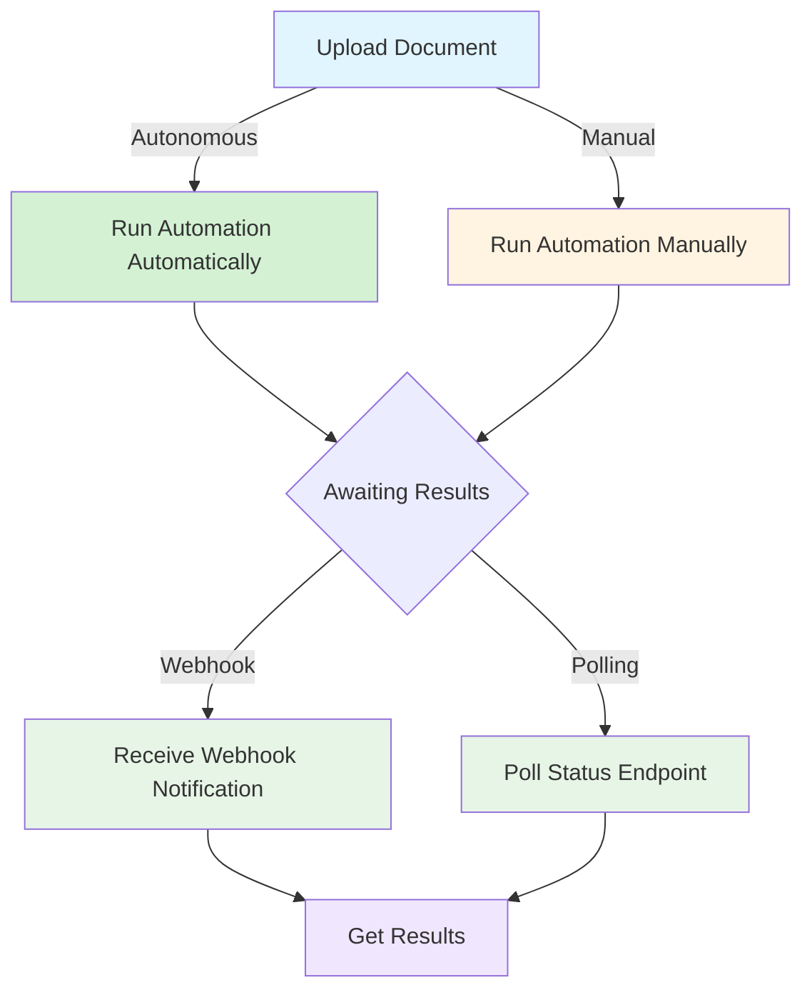

## Overview

This guide walks you through making your first API calls to Alto Health. You'll upload a medical referral document and trigger automated pathway execution to process it.

<Info>
  **Prerequisites:**
  - Your Alto Health API credentials (organization ID, platform API key, authentication token)
  - A sample medical document (PDF or image)
  - A configured pathway in your Alto Health account
  - Basic knowledge of REST APIs
</Info>

## Two Ways to Process Documents

Alto Health offers two approaches for processing documents:

<AccordionGroup>
  <Accordion icon="bolt" title="Run Automation Automatically (Recommended - Fastest)">
    **What it does:** Upload your document and Alto Health automatically processes everything.

    **Steps required:**
    1. Upload document
    2. Wait for results (via webhook or polling)

    **Best for:** Production systems where you want the fastest, simplest integration. Just upload and let Alto Health handle the rest.
  </Accordion>

  <Accordion icon="hand" title="Run Automation Manually">
    **What it does:** Upload your document, then explicitly trigger automation via API call.

    **Steps required:**
    1. Upload document
    2. Call the automation endpoint manually
    3. Wait for results (via webhook or polling)

    **Best for:** Workflows where you need control over when automation starts, or when you want to perform additional operations between upload and processing.
  </Accordion>
</AccordionGroup>

<Note>
This quickstart shows the **Manual** approach to demonstrate all available API endpoints. For the autonomous approach, simply skip Step 2 after uploading your document.
</Note>

## Complete Workflow

We'll build a simple workflow that:
1. Uploads a medical referral document
2. **(Optional - Manual only)** Triggers automated pathway execution
3. Receives results via webhook or polling

### Workflow Overview

<Note>
**Autonomous (Green path):** Fastest approach - upload and Alto Health automatically handles extraction, rules, and actions.

**Manual (Yellow path):** Upload, then explicitly trigger automation for more control.

**Get results via:**
- **Webhook (Recommended):** Alto Health automatically sends results to your endpoint when processing completes
- **Polling:** Your service periodically checks the status endpoint until completion
</Note>

### Step 1: Upload a Document

Upload a medical referral document to Alto Health using the Upload Document endpoint.

<Card
  title="Upload Document"
  icon="upload"
  href="/api-reference/endpoint/document-upload"
>
  See complete endpoint documentation with code examples in Python, JavaScript, cURL, and C#
</Card>

<Tip>
Save the `record_id` from the response. You'll need it if you're using manual automation (Step 2).
</Tip>

<Info>
**Using Autonomous mode?** You're done! Alto Health will automatically process your document. Skip to "What Happens Next?" to learn how to receive your results via webhook or polling.
</Info>

### Step 2: Run Automation Manually (Optional)

<Warning>
**Skip this step if using Autonomous mode.** With autonomous automation, processing starts automatically after upload. Only complete this step if you need manual control over when automation starts.
</Warning>

Trigger the automated pathway to process the document using the record ID from Step 1.

<Card
  title="Run Automation Manually"
  icon="play"
  href="/api-reference/endpoint/run-automation"
>
  See complete endpoint documentation with code examples and pathway types
</Card>

<Note>
The pathway executes asynchronously. Results will be delivered via:
- **Webhook** (if configured) - Alto Health POSTs results to your endpoint
- **Polling** - Query the status endpoint periodically

See the [Webhooks guide](/guides/webhooks) for setting up webhook notifications.
</Note>

## What Happens Next?

After uploading your document (and optionally triggering automation manually):

1. **Automated Processing** - Alto Health automatically:
   - Extracts clinical data from the document
   - Evaluates rules and conditions based on your configured pathways
   - Executes configured actions (notifications, routing, triage recommendations, etc.)
   - Updates record status

2. **Receive Results** - Choose your preferred method:
   - **Webhook (Recommended)**: Configure a webhook URL to receive automatic notifications when processing completes
   - **Polling**: Query your system to check pathway completion status

<Tip>
**Fastest workflow:** Use **Autonomous mode** with **Webhooks** for real-time data extraction and triage recommendations. Just upload your document and receive results instantly via webhook - no manual intervention needed!

See the [Webhooks guide](/guides/webhooks) for setup instructions.
</Tip>